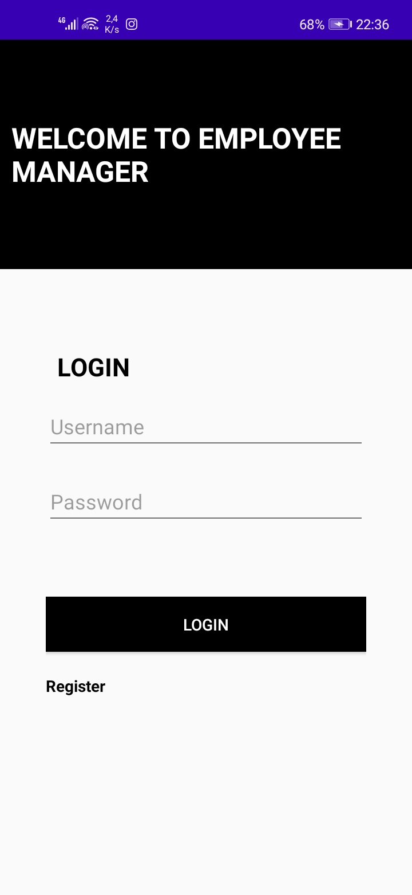

# "Employee Manager Front End Android part " 

## This is an android application written in java.

## This project is written using the MVVM architecture and utilizes Retrofit to make HTTP calls to the backend

## This project communicates with the corresponding SPRING BOOT backend through REST API.

## link to the backend part of this application - https://github.com/gontsezuka/EmployeesBackend

